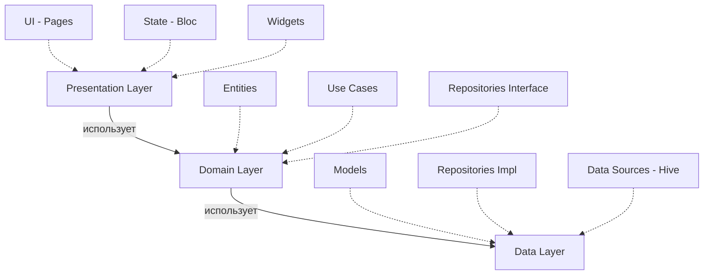

<div align="center">

# 📦 WMS Testing Flutter

### Нативное приложение для тестирования знаний по Warehouse Management Systems

[](https://flutter.dev)
[](https://dart.dev)
[](LICENSE)
[](CONTRIBUTING.md)

[Особенности](#-особенности) • [Установка](#-установка) • [Архитектура](#-архитектура) • [Скриншоты](#-скриншоты) • [Документация](#-документация)

</div>

---

## ✨ Особенности

<table>
<tr>
<td width="50%">

### 📚 Функционал
- ✅ **25 вопросов** по WMS системам
- ✅ **15+ категорий** (Приемка, Размещение, Комплектация...)
- ✅ **4 уровня** сложности
- ✅ **Детальные объяснения** к каждому ответу
- ✅ **История тестов** с статистикой
- ✅ **Офлайн режим** - работает без интернета

</td>
<td width="50%">

### � Технологии
- 🎯 **Flutter 3.2+** - Кроссплатформенность
- 🧩 **Bloc Pattern** - Управление состоянием
- 🗄️ **Hive** - Локальная NoSQL БД
- 🎨 **Material Design 3** - Современный UI
- 🔥 **Firebase** - Analytics & Auth
- 🚀 **Go Router** - Навигация

</td>
</tr>
</table>

---

## 🏗 Архитектура

Проект построен на принципах **Clean Architecture**:



<details>
<summary><b>� Структура проекта</b></summary>

```
lib/
├── main.dart                 # 🚀 Точка входа
├── core/                     # 🔧 Общие утилиты
│   ├── constants/           #    Константы
│   ├── theme/               #    Темы оформления
│   ├── utils/               #    Вспомогательные функции
│   └── errors/              #    Обработка ошибок
├── data/                     # 💾 Слой данных
│   ├── datasources/         #    Источники (Hive, API)
│   ├── models/              #    Модели данных
│   └── repositories/        #    Реализация репозиториев
├── domain/                   # 🎯 Бизнес-логика
│   ├── entities/            #    Сущности
│   ├── repositories/        #    Интерфейсы
│   └── usecases/            #    Сценарии использования
└── presentation/             # 🎨 UI слой
    ├── blocs/               #    State Management
    ├── pages/               #    Экраны
    └── widgets/             #    Переиспользуемые компоненты
```
</details>

---

## � Установка

### Требования
- Flutter SDK 3.2.0 или выше
- Dart 3.0 или выше
- Android Studio / VS Code / IntelliJ IDEA

### Быстрый старт

```bash
# 1️⃣ Клонировать репозиторий
git clone https://github.com/Kiryushaboy/wms_testing_flutter.git
cd wms_testing_flutter

# 2️⃣ Установить зависимости
flutter pub get

# 3️⃣ Сгенерировать код для Hive TypeAdapters
flutter pub run build_runner build --delete-conflicting-outputs

# 4️⃣ Запустить приложение
flutter run
```

<details>
<summary><b>� Дополнительные команды</b></summary>

```bash
# Проверить доступные устройства
flutter devices

# Запустить на конкретном устройстве
flutter run -d <device_id>

# Сборка для продакшена (Android)
flutter build apk --release

# Сборка для продакшена (iOS)
flutter build ios --release

# Анализ кода
flutter analyze

# Запуск тестов
flutter test
```
</details>

---

## 📦 Технологический стек

| Категория | Пакет | Версия | Назначение |
|-----------|-------|--------|------------|
| 🎨 **UI** | Material Design 3 | Built-in | Дизайн система |
| 🎨 **UI** | google_fonts | ^6.1.0 | Шрифты (Inter) |
| 🧭 **Navigation** | go_router | ^14.0.0 | Маршрутизация |
| 🔄 **State** | flutter_bloc | ^8.1.6 | Управление состоянием |
| 🗄️ **Storage** | hive | ^2.2.3 | NoSQL база |
| 🗄️ **Storage** | hive_flutter | ^1.1.0 | Flutter интеграция |
| 🌐 **Network** | dio | ^5.4.0 | HTTP клиент |
| 🔥 **Backend** | firebase_core | ^3.0.0 | Firebase SDK |
| 🔥 **Backend** | firebase_auth | ^5.0.0 | Аутентификация |
| 📊 **Analytics** | firebase_analytics | ^11.0.0 | Метрики |
| ⚙️ **Utils** | equatable | ^2.0.5 | Value equality |
| 🔨 **DevTools** | build_runner | ^2.4.6 | Кодогенерация |

---

## 📚 Данные

### Категории вопросов
```
📦 Приемка          🔄 Перемещение         🎯 Зоны склада
📍 Размещение       ⚙️ Процессы            📊 Оптимизация
✅ Комплектация     🔐 Резервирование      🚀 Технологии
📋 Инвентаризация   📤 Отгрузка           📝 Документация
```

### Уровни сложности
- 🟢 **Базовый** - Основные понятия
- 🟡 **Средний** - Практические задачи
- 🟠 **Продвинутый** - Сложные сценарии
- 🔴 **Эксперт** - Экспертные знания

---

## 🎨 Скриншоты

<table>
<tr>
<td width="33%">
  
  <p align="center"><b>Стартовый экран</b></p>
</td>
<td width="33%">
  
  <p align="center"><b>Прохождение теста</b></p>
</td>
<td width="33%">
  
  <p align="center"><b>Результаты</b></p>
</td>
</tr>
</table>

---

## 📖 Документация

| Документ | Описание |
|----------|----------|
| 📘 [SETUP_GUIDE.md](SETUP_GUIDE.md) | Пошаговая инструкция по настройке |
| 🏗️ [ARCHITECTURE.md](ARCHITECTURE.md) | Подробное описание архитектуры |
| 📊 [PROJECT_SUMMARY.md](PROJECT_SUMMARY.md) | Итоговый отчет по проекту |

---

## 🤝 Вклад в проект

Мы приветствуем ваш вклад! 

1. 🍴 Fork репозитория
2. 🔧 Создайте feature branch (`git checkout -b feature/AmazingFeature`)
3. 💾 Commit изменения (`git commit -m 'Add some AmazingFeature'`)
4. 📤 Push в branch (`git push origin feature/AmazingFeature`)
5. 🔃 Откройте Pull Request

---

## 📝 Лицензия

Этот проект распространяется под лицензией MIT. См. [LICENSE](LICENSE) для подробностей.

---

## 👨‍💻 Автор

<div align="center">

**Kiryushaboy**

[](https://github.com/Kiryushaboy)
[](https://t.me/kiryushaboy)

</div>

---

## 🌟 Поддержка проекта

Если вам понравился проект:
- ⭐ Поставьте звезду на GitHub
- 🐛 Сообщите о багах в [Issues](https://github.com/Kiryushaboy/wms_testing_flutter/issues)
- 💡 Предложите новые фичи
- 📢 Расскажите друзьям

---

<div align="center">

**Сделано с ❤️ с помощью Flutter и GitHub Copilot**

*Дата создания: 31 октября 2025*

</div>
